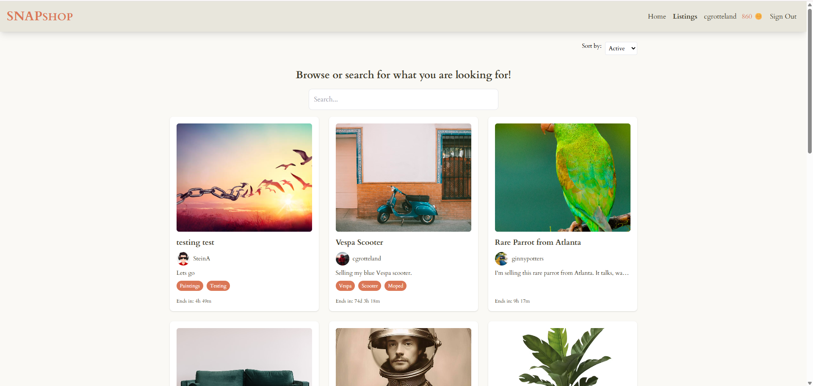
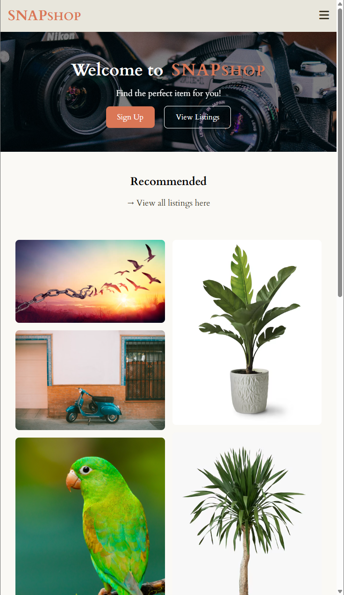

# SnapShop Auction House




Noroff semester project year 2, an auction platform built with **HTML**, **Tailwind CSS**, and **Vanilla JavaScript**.

## Features

- User registration & login
- Create, edit, and delete auction listings with images
- Place bids and view bid history with live updates
- Responsive design for mobile and desktop

---

## Installation

1. **Clone the repo**

   ```bash
   git clone https://github.com/cgrotteland92/Semester-project-2.git
   cd snapshop
   ```

2. **Install dependencies**

   ```bash
   npm install
   ```

---

## Usage

- **Home:** `index.html`
- **Browse Listings:** `allPosts.html`
- **View Single Listing:** `singlePost.html`
- **Register:** `register.html`
- **Log In:** `login.html`
- **Profile Dashboard:** `profile.html`
